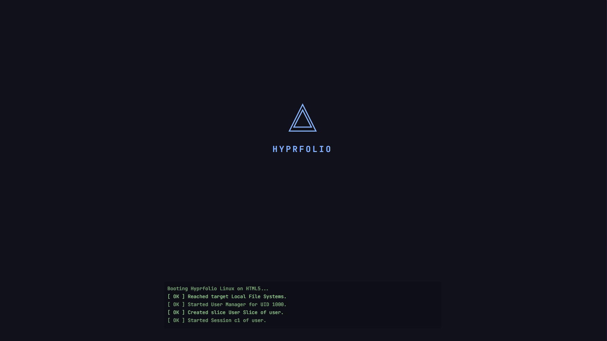
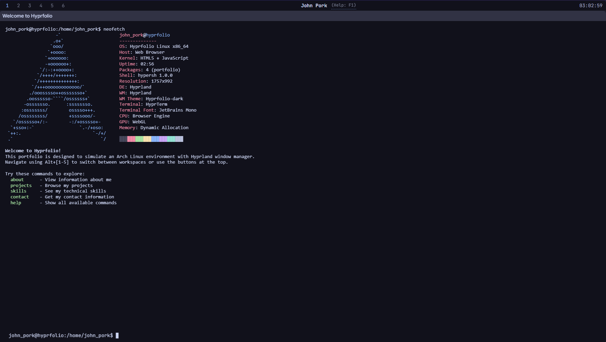

<p align="center">
  
</p>

<h2 align="center">Hyprfolio</h2>

<p align="center">
  An interactive portfolio website that simulates an Arch Linux environment with the Hyprland window manager.
</p>

<p align="center">
  
  
</p>

## Built With

- Pure HTML5, CSS3, and vanilla JavaScript
- ES6 modules for clean architecture
- No external dependencies or frameworks
- Custom implementations of all features

## Features

- **Window Manager**: Fully functional window management with drag, resize, and snap capabilities
- **Waybar**: Status bar with workspace indicators and real-time clock
- **Terminal**: Fully functional terminal emulator with ANSI color support
- **File System**: Fully functional file system with standard commands
- **Mobile Support**: Mobile-optimized menu and simplified view toggle for smaller screens

### Custom Commands

- `neofetch` - Display system info in Arch Linux style
- `about` - Learn about John Pork
- `projects` - Browse portfolio projects
- `skills` - View technical skills with visual progress bars
- `contact` - Get contact information
- `resume` - View resume content
- `help` - List all available commands

## Project Structure

```
xjarusr00/
├── index.html          # Main HTML file
├── css/
│   ├── main.css       # Core styles
│   ├── terminal.css   # Terminal-specific styles
│   ├── windows.css    # Window manager styles
│   ├── responsive.css # Mobile responsiveness
│   └── themes/        # Theme files
├── js/
│   ├── main.js        # Application entry point
│   ├── terminal.js    # Terminal emulator
│   ├── windowManager.js # Window management
│   ├── fileSystem.js  # Virtual file system
│   └── commands.js    # Terminal commands
└── README.md          # This file
```

### Usage

Run a Python HTTP server from this directory. No packages required; it's pure JavaScript with no external libraries.

## License

This project is open source and available under the [MIT License](LICENSE).

_Built with ❤️ and I use Arch btw._
